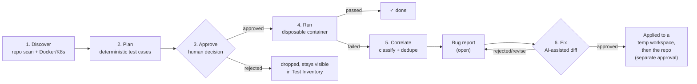
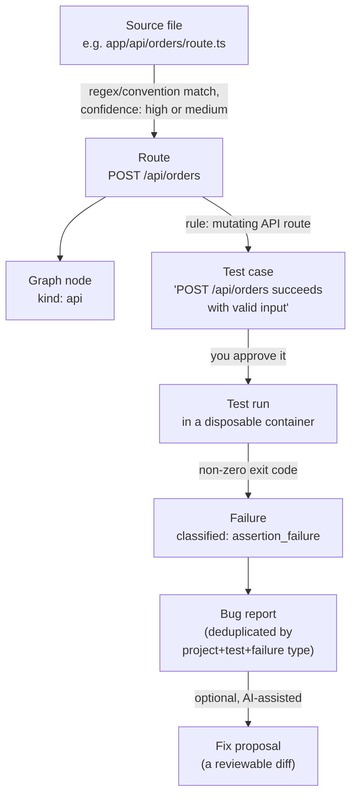
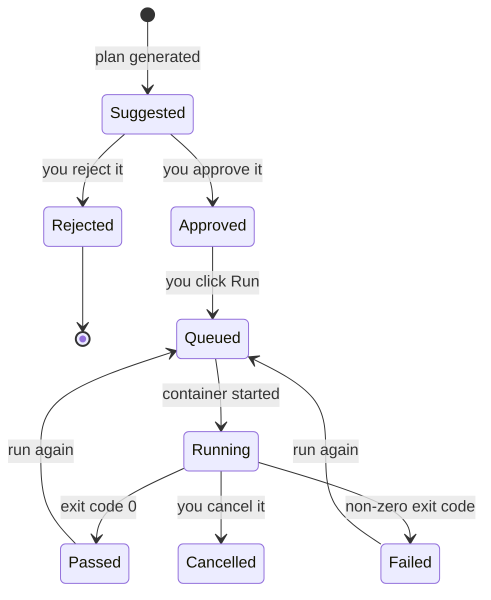

# E2E Sentinel

E2E Sentinel is a self-hosted, AI-assisted quality engineering platform. It
discovers a repository and its runtime architecture, produces a reviewable
test inventory and risk-based E2E test plan, generates and executes tests
in isolated runners, correlates failures across layers, and proposes fixes
as reviewable diffs — never changing source code, infrastructure, or data
without explicit approval.

This repository is being built incrementally against
[`E2E_SENTINEL_CODEX_MASTER_SPEC.md`](E2E_SENTINEL_CODEX_MASTER_SPEC.md).
**Phases 0–11** are implemented (Phase 11 partially — see
[docs/TEST_ADAPTERS.md](docs/TEST_ADAPTERS.md)); see
[docs/ROADMAP.md](docs/ROADMAP.md) for what's next and
[docs/ARCHITECTURE.md](docs/ARCHITECTURE.md) /
[ADR 0001](docs/adr/0001-phase0-foundation.md) for the reasoning behind
the foundational choices.

> **Using an AI coding assistant (Claude Code, Cursor, Codex, Copilot,
> etc.) on this repo?** Start with [`AGENTS.md`](AGENTS.md) instead — repo
> map, a docs index, the conventions this codebase follows, and how to
> verify a change before calling it done.

## The pipeline, end to end

This is the same flow shown on the Dashboard at `http://localhost:9090`,
with live counts.



Two diamond shapes are the only places a human decision gates the flow:
**approving a test case** before it can run, and **approving a fix
proposal** before it touches a temporary workspace (and again, separately,
before it touches your real repository). Everything else is automatic.

## Getting started

```bash
cp .env.example .env        # set a real POSTGRES_PASSWORD
make up                     # builds the Playwright runner image, then docker compose up -d --build
open http://localhost:9090  # the panel
```

`make up` (not `docker compose up` directly) is required from Phase 5 on
— it computes the host path `sentinel-api` needs to launch disposable
test-runner containers. This also mounts the Docker socket into
`sentinel-api` — see [docs/RUNNER_ISOLATION.md](docs/RUNNER_ISOLATION.md)
for what that means and why.

```bash
make down        # stop the stack
```

See [docs/LOCAL_DEVELOPMENT.md](docs/LOCAL_DEVELOPMENT.md) for running the
API and web app outside Docker, and
[docs/DEPLOYMENT.md](docs/DEPLOYMENT.md) for deployment notes.

## Step by step

### 1. Add a project — *Projects* page

Give it a name and the **absolute path** to a repository, as seen from
inside the `sentinel-api` container (see
[docs/LOCAL_DEVELOPMENT.md](docs/LOCAL_DEVELOPMENT.md) for how to mount
your repo under `./workspace`). E2E Sentinel validates the path exists
and is a real directory before storing it — nothing runs yet.

### 2. Run discovery — *Discovery* page

Click **Run discovery**. This is a deterministic file scan: languages,
frameworks, CI config, Docker Compose services, existing test tooling,
API schemas. Every finding shows its **evidence** (the file that proved
it) and a **confidence** level (`high` for an explicit declaration like
an OpenAPI path, `medium` for a regex-matched guess) — never presented
as more certain than the detection method actually warrants. If a
`docker-compose.yml` was found, its services show up here too, with live
running status if the Docker daemon is reachable (and "not observed" —
not a false "not running" — if it isn't).

### 3. Check the application graph — *Application Map* page

Routes extracted during discovery become nodes; the graph links them to
the services that likely implement them. This is the map test planning
reads from — if a route is missing here, it won't get a test case
suggested for it either. See
[Where does this come from?](#where-does-this-come-from) below for the
full evidence chain.

### 4. Set an environment's base URL — *Environments* page

Every project gets a default environment. Give it a `base_url` (where
the app actually runs) before you can execute anything — a generated
test needs something real to point at. Classifying an environment
`production` (or leaving it `unknown`) automatically turns off mutating
tests, load tests, and active security scans for it; that's not a
checkbox you can override by mistake.

### 5. Generate a test plan — *Test Inventory* page

Click **Generate plan**. Fixed rules turn each discovered route into one
or more suggested test cases — a login route gets a "valid credentials"
and an "invalid credentials" case; an admin route gets an authorization
check; a WebSocket endpoint gets a connectivity smoke test. Every
suggestion is traceable back to the route and rule that produced it. No
AI is involved in this step, ever.

### 6. Review and approve — *Approvals* page

Nothing runs until a human approves it. This page lists every pending
test case; approve the ones you want executed, reject the ones you
don't (rejected cases stay visible in Test Inventory, not deleted — you
can see what was suggested and why it was turned down). See
[docs/APPROVAL_MODEL.md](docs/APPROVAL_MODEL.md) for the full rule set,
including why a mutating test can't be approved against a
production-classified environment.

### 7. Run a test — *Test Inventory* / *Runs* page

An approved test executes inside its own disposable, resource-limited
container — never in `sentinel-api`'s own process. Pass/fail comes
**only** from that container's exit code; nothing upstream can overrule
it. Watch it live on the *Runs* page, or from the Dashboard's
"Currently running" panel if something is in flight right now.

### 8. A failure becomes a bug report — *Bugs* page

A failed run is automatically classified (one of 17 fixed failure
types — timeout, assertion, network failure, and so on) and turned into
a bug report, or merged into an existing one for the same test +
failure type rather than creating a duplicate. The root cause is always
labeled an **unverified hypothesis** — a starting point for you to
confirm, never a verdict.

### 9. Propose and review a fix — *Fix Proposals* page

From an open bug, optionally generate a candidate diff (this is the one
place AI can be involved, and only if you've configured a provider — see
step 11). The diff is never auto-applied: approve it to write to a
disposable copy of the repository first, review that, then approve
again to write to the real repository — and that real-repository write
can only ever happen once per proposal.

### 10. Kubernetes discovery (optional) — *Kubernetes* page

If you've pointed E2E Sentinel at a cluster (`SENTINEL_KUBE_CONFIG_PATH`
or an in-cluster ServiceAccount — see
[docs/KUBERNETES_DISCOVERY.md](docs/KUBERNETES_DISCOVERY.md)), this page
shows namespaces, workloads, replica health, restart counts, and lets
you pull recent events and pod logs. Read-only — nothing here can ever
change what's running in your cluster.

### 11. AI providers (optional) — *AI Providers* page

Configure Ollama (local, free) or a hosted provider (OpenAI, Anthropic,
Gemini, Azure) if you want AI-assisted fix generation. Every feature
through step 8 works with **zero** AI configured — this page only
affects step 9.

## Where does this come from?

Every entity in the system traces back to something you can point at —
a file, a route, a container. This is the chain discovery → planning →
execution → failure follows for one route:



Click through from any test case, run, or bug in the panel and you'll
find this same chain — the route it came from, the file that proved
that route exists, and (for a run) the exact generated spec file that
was executed.

## Where is my test right now?

A test case and a test run are two different lifecycles — a test case
is a standing suggestion you approve once; a run is one execution of it.



The *Runs* page always reflects the run lifecycle (right column,
above); the *Approvals*/*Test Inventory* pages reflect the test-case
lifecycle (left column). A test case can be approved once and run many
times — each run gets its own row, its own artifacts, and (if it fails)
its own failure/bug trail.

## Quick reference: which page is for what

| Page | What it's for | You'll know it's working when |
|---|---|---|
| Dashboard | The pipeline at a glance — counts, what needs attention, what's running right now | A stage's badge turns red exactly when something there needs a decision |
| Projects | Register a repository | Discovery status shows `completed`, not `failed` |
| Discovery | Deterministic repo scan results + Docker Compose services | Every finding shows a source-file path and a confidence level |
| Application Map | The route/service graph | Routes you know exist in the repo appear as nodes |
| Test Inventory | Every suggested test case, approved or not | A route you care about has at least one suggested case |
| Approvals | The human gate before anything runs | Nothing is stuck "pending" that you meant to approve or reject |
| Runs | Live and historical test executions | A run reaches `passed`/`failed`, not stuck `running` |
| Bugs | Classified, deduplicated failure reports | One bug per real problem, not one per failed run |
| Fix Proposals | Reviewable diffs for open bugs | The diff matches what you'd expect from the bug's evidence |
| Environments | Per-environment base URL + safety classification | `base_url` is set before you try to run anything |
| AI Providers | Optional AI configuration | Page is fully usable and shows "not configured" if you skip it |
| Kubernetes | Optional read-only cluster discovery | Shows "not configured" if `SENTINEL_KUBE_CONFIG_PATH` is unset — that's expected, not broken |
| Audit Logs | Append-only record of every action taken | Every approval/run/discovery you triggered has a matching row |
| Settings | User/role management (only meaningful once RBAC is on) | — |

## What's implemented

- Go API (`apps/api`) with structured logging, environment-based config,
  a PostgreSQL-backed audit log, and `/health` / `/ready` / `/api/v1/audit-events`.
- **Projects & repository discovery**: add a project by absolute path
  (validated — must exist, must be a directory, cannot be a system root,
  symlinks resolved before any check), then run a deterministic scan that
  detects languages, frameworks, Docker files, CI pipelines, existing test
  tooling (Playwright/Cypress/Maestro/Detox/Postman), and API schemas —
  each finding carries file-path evidence and a confidence level.
- **Environments**: every project gets a default environment; classifying
  it `production` or `unknown` forces mutation/load-test/security-scan
  permissions off in the same request (spec §2.6).
- **Docker Compose service discovery**: compose files found during
  discovery are parsed directly (no `docker compose` subprocess) into
  declared services — image, ports, dependencies, env var *names* only.
  If the Docker daemon is reachable (never required, and not mounted by
  default), services are enriched with live running status; otherwise
  they show as "not observed", never as a false "not running".
- **Application Graph**: routes are extracted (Next.js file conventions,
  OpenAPI paths, regex-matched Express/Go/Flask router calls) and
  correlated with discovered services into an evidence-backed graph —
  e.g. `Login Page --calls--> POST /api/v1/auth/login --served_by--> api`.
  Every edge carries its evidence and a confidence level; ambiguous
  relationships (e.g. more than one candidate service) produce no edge
  rather than a guess.
- **Test planning**: risk-scored (P0–P3) test case suggestions generated
  from extracted routes using fixed, deterministic rules — no AI call is
  made or possible. Mutating tests default to production-unsafe;
  approving one is blocked (403) while the project has a production or
  unknown-classified environment. Suggestions can be approved, rejected,
  or edited, and regenerating a plan never overwrites a test the user
  already reviewed.
- **Test execution**: an approved test case runs in its own disposable,
  resource-limited Docker container — a real Chromium browser for page
  tests, an HTTP request for API tests. The generated spec is templated
  deterministically (no AI). Pass/fail comes only from the container's
  exit code. Failed runs capture stdout/stderr, a screenshot, a video,
  and a Playwright trace automatically; runner containers are removed
  after every run, including failures. Cancellation stops the container
  by a deterministic name, so it works even though execution runs in a
  background goroutine.
- **AI Providers**: configure Ollama, OpenAI, Anthropic, Gemini, Azure
  OpenAI, or an OpenAI-compatible endpoint; test connectivity live; route
  individual AI-assisted task types (test planning, failure analysis,
  fix generation, etc.) to different providers. API keys are encrypted
  at rest and never returned through the API — only whether one is
  configured. The app is fully usable with zero providers configured
  (spec §16.6 "No-AI Mode"); Phase 8's fix generation is the first
  feature that actually calls a routed provider.
- **Failure analysis & bug reports**: a failed test run is automatically
  classified (17 failure types, a fixed severity mapping, a flaky-test
  assessment) and turned into a structured, evidence-backed bug report —
  deterministically, no AI call involved. Repeated failures of the same
  kind on the same test update one bug (frequency/last-observed) instead
  of spawning duplicates; a different test with the same failure type
  gets an unconfirmed "possible duplicate" hint. Root cause is always
  presented as an explicitly-labeled hypothesis, never a confirmed
  diagnosis. Bugs can be searched/filtered, resolved, reopened, annotated,
  and exported as Markdown or JSON.
- **Fix proposals**: a candidate unified diff for a bug — either pasted
  manually or (evidence-only, no repository source read) generated by
  whichever provider is routed for `fix_generation`. The AI can never
  apply anything itself: every proposal starts `pending_review`, can be
  tested by applying it to a disposable copy of the repository, and only
  reaches the real repository through an explicit `approve` followed by
  `apply-repository` — which re-parses the exact diff that was approved
  and can run at most once per proposal. A path-traversal check runs
  before every write, for both the temporary workspace and the real
  repository.
- **Production hardening**: opt-in RBAC (`SENTINEL_AUTH_ENABLED`, off by
  default) with five roles, bcrypt/bearer-token auth, and a fixed
  permission mapping gating the mutating routes spec §19 calls out;
  security headers, per-IP rate limiting, and a CSRF header check on
  every response/mutating request; searchable, still-immutable audit
  events; a retention sweep for expired artifacts; a `/metrics`
  endpoint; a threat-model table; and `make scan` (govulncheck + npm
  audit, also in CI) for dependency scanning.
- **Kubernetes discovery**: opt-in, read-only (`SENTINEL_KUBE_CONFIG_PATH`
  or in-cluster ServiceAccount credentials, unset by default) discovery
  of namespaces, Deployments/StatefulSets/DaemonSets (replica health,
  restart counts), Jobs/CronJobs, Services/Ingresses (mapped to each
  other), best-effort Gateway API, and Secret/ConfigMap *names* only —
  never values, structurally, not just by policy. A read-only ClusterRole
  example ships at `deploy/k8s/read-only-clusterrole.yaml`; a partial RBAC
  restriction or a missing CRD degrades to a warning, never a failed
  request.
- **WebSocket test adapter** (one of spec §25 Phase 11's eight tools —
  see [docs/TEST_ADAPTERS.md](docs/TEST_ADAPTERS.md) for why the other
  seven are documented as deferred instead of built): repository scan
  detects `ws://`/`wss://` URL literals, planning generates a
  connectivity smoke-test case, and a dedicated disposable-container
  runner (plain Node.js + `ws`, no browser stack) executes it —
  pass/fail from the script's own exit code, no AI involved.
- A Next.js panel (`apps/web`) on port `9090`: Dashboard, Audit Logs,
  Projects, Discovery (findings + services), Application Map, Kubernetes,
  Test Inventory, Runs, AI Providers, Bugs, and Fix Proposals are
  functional; the remaining nav sections are stub pages pointing at the
  phase that implements them.
- Versioned SQL migrations with a small custom runner.
- Docker Compose stack: `sentinel-api`, `sentinel-web`, `postgres`,
  `redis`, plus disposable Playwright runner containers launched on
  demand.

Nothing yet does Helm deployment of E2E Sentinel itself, and there's no
git integration (commits, branches, pushes, PRs) — those are reserved
for later. Discovery still only *reads* file names/contents to classify
them. Test execution runs the generated spec in full isolation — see
[docs/RUNNER_ISOLATION.md](docs/RUNNER_ISOLATION.md) for exactly what
that container can and can't do. Fix proposals are the one place E2E
Sentinel *does* write to a target repository's files directly — never
without an explicit prior approval, and only once per proposal — see
[docs/FIX_PROPOSALS.md](docs/FIX_PROPOSALS.md). See
[docs/AI_PROVIDER_GUIDE.md](docs/AI_PROVIDER_GUIDE.md) for configuring an
AI provider.

## Repository layout

```text
apps/api/         Go backend (cmd/sentinel, internal/*)
apps/web/         Next.js panel
migrations/       Versioned SQL migrations
deploy/docker/    Dockerfiles
tests/integration/  Black-box tests against a running stack
docs/             Architecture, security, operational docs
```

## Safety model

E2E Sentinel starts in read-only observation mode and requires explicit,
action-specific, time-bounded, auditable approval before anything mutating
happens (writing generated tests, applying patches, restarting services,
pushing branches, etc.). See [docs/SECURITY_MODEL.md](docs/SECURITY_MODEL.md)
and [SECURITY.md](SECURITY.md).

## If something looks stuck or wrong

Check [docs/TROUBLESHOOTING.md](docs/TROUBLESHOOTING.md) first — it
covers the setup issues that come up most. For anything about *why* a
specific decision (approval, classification, one-shot patch application)
works the way it does, [docs/ARCHITECTURE.md](docs/ARCHITECTURE.md)'s
domain-flow sections walk through the exact code path.

## Contributing

See [CONTRIBUTING.md](CONTRIBUTING.md).
