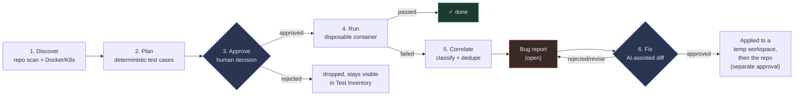
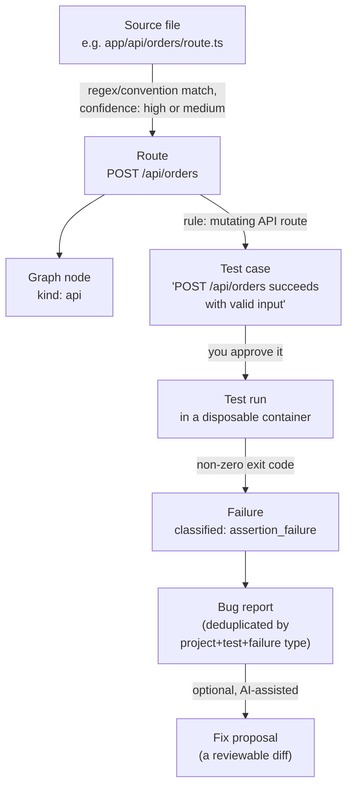
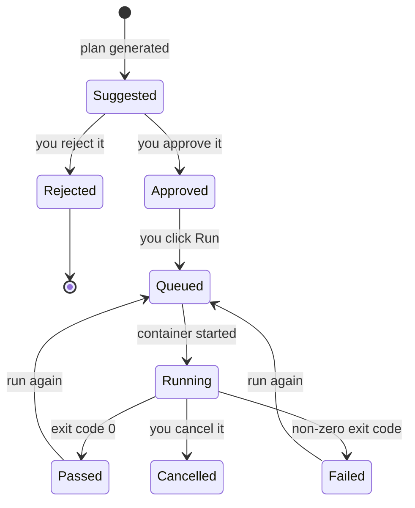

# Using E2E Sentinel

A walkthrough of the actual workflow, in the order you'll do it, with a
diagram for every "where did this come from" and "where is this right
now" question. If you only read one section, read
[The pipeline, end to end](#the-pipeline-end-to-end) and
[Where is my test right now?](#where-is-my-test-right-now).

## What it does, in one paragraph

E2E Sentinel points at a repository, figures out what it is (languages,
frameworks, Docker/Kubernetes services, existing tests, API routes) with
no AI required, turns that into a reviewable test plan, runs approved
tests in disposable containers, correlates any failure into a
deduplicated bug report, and can propose a fix as a diff — but never
writes to your repository, never runs a mutating test against
production, and never approves anything itself. Every step that could
matter stops and waits for you.

## The pipeline, end to end

This is the same flow shown on the Dashboard, with live counts, at
`http://localhost:9090`.



Two diamond shapes are the only places a human decision gates the flow:
**approving a test case** before it can run, and **approving a fix
proposal** before it touches a temporary workspace (and again, separately,
before it touches your real repository). Everything else is automatic.

## Getting started

Prerequisites and first-run commands live in
[docs/LOCAL_DEVELOPMENT.md](LOCAL_DEVELOPMENT.md); the short version:

```bash
cp .env.example .env        # set a real POSTGRES_PASSWORD
make up                     # builds images, starts the stack
open http://localhost:9090  # the panel
```

Everything below assumes the stack is running and you have the panel
open.

## Step by step

### 1. Add a project — *Projects* page

Give it a name and the **absolute path** to a repository, as seen from
inside the `sentinel-api` container (see
[docs/LOCAL_DEVELOPMENT.md](LOCAL_DEVELOPMENT.md) for how to mount your
repo under `./workspace`). E2E Sentinel validates the path exists and is
a real directory before storing it — nothing runs yet.

### 2. Run discovery — *Discovery* page

Click **Run discovery**. This is a deterministic file scan: languages,
frameworks, CI config, Docker Compose services, existing test tooling,
API schemas. Every finding shows its **evidence** (the file that proved
it) and a **confidence** level (`high` for an explicit declaration like
an OpenAPI path, `medium` for a regex-matched guess) — never presented
as more certain than the detection method actually warrants. If a
`docker-compose.yml` was found, its services show up here too, with live
running status if the Docker daemon is reachable (and "not observed" —
not a false "not running" — if it isn't).

### 3. Check the application graph — *Application Map* page

Routes extracted during discovery become nodes; the graph links them to
the services that likely implement them. This is the map test planning
reads from — if a route is missing here, it won't get a test case
suggested for it either. See
[Where does this come from?](#where-does-this-come-from) below for the
full evidence chain.

### 4. Set an environment's base URL — *Environments* page

Every project gets a default environment. Give it a `base_url` (where
the app actually runs) before you can execute anything — a generated
test needs something real to point at. Classifying an environment
`production` (or leaving it `unknown`) automatically turns off mutating
tests, load tests, and active security scans for it; that's not a
checkbox you can override by mistake.

### 5. Generate a test plan — *Test Inventory* page

Click **Generate plan**. Fixed rules turn each discovered route into one
or more suggested test cases — a login route gets a "valid credentials"
and an "invalid credentials" case; an admin route gets an authorization
check; a WebSocket endpoint gets a connectivity smoke test. Every
suggestion is traceable back to the route and rule that produced it. No
AI is involved in this step, ever.

### 6. Review and approve — *Approvals* page

Nothing runs until a human approves it. This page lists every pending
test case; approve the ones you want executed, reject the ones you
don't (rejected cases stay visible in Test Inventory, not deleted — you
can see what was suggested and why it was turned down). See
[docs/APPROVAL_MODEL.md](APPROVAL_MODEL.md) for the full rule set,
including why a mutating test can't be approved against a
production-classified environment.

### 7. Run a test — *Test Inventory* / *Runs* page

An approved test executes inside its own disposable, resource-limited
container — never in `sentinel-api`'s own process. Pass/fail comes
**only** from that container's exit code; nothing upstream can overrule
it. Watch it live on the *Runs* page, or from the Dashboard's
"Currently running" panel if something is in flight right now.

### 8. A failure becomes a bug report — *Bugs* page

A failed run is automatically classified (one of 17 fixed failure
types — timeout, assertion, network failure, and so on) and turned into
a bug report, or merged into an existing one for the same test +
failure type rather than creating a duplicate. The root cause is always
labeled an **unverified hypothesis** — a starting point for you to
confirm, never a verdict.

### 9. Propose and review a fix — *Fix Proposals* page

From an open bug, optionally generate a candidate diff (this is the one
place AI can be involved, and only if you've configured a provider — see
step 11). The diff is never auto-applied: approve it to write to a
disposable copy of the repository first, review that, then approve
again to write to the real repository — and that real-repository write
can only ever happen once per proposal.

### 10. Kubernetes discovery (optional) — *Kubernetes* page

If you've pointed E2E Sentinel at a cluster (`SENTINEL_KUBE_CONFIG_PATH`
or an in-cluster ServiceAccount — see
[docs/KUBERNETES_DISCOVERY.md](KUBERNETES_DISCOVERY.md)), this page
shows namespaces, workloads, replica health, restart counts, and lets
you pull recent events and pod logs. Read-only — nothing here can ever
change what's running in your cluster.

### 11. AI providers (optional) — *AI Providers* page

Configure Ollama (local, free) or a hosted provider (OpenAI, Anthropic,
Gemini, Azure) if you want AI-assisted fix generation. Every feature
through step 8 works with **zero** AI configured — this page only
affects step 9.

## Where does this come from?

Every entity in the system traces back to something you can point at —
a file, a route, a container. This is the chain discovery → planning →
execution → failure follows for one route:



Click through from any test case, run, or bug in the panel and you'll
find this same chain — the route it came from, the file that proved
that route exists, and (for a run) the exact generated spec file that
was executed.

## Where is my test right now?

A test case and a test run are two different lifecycles — a test case
is a standing suggestion you approve once; a run is one execution of it.



The *Runs* page always reflects the run lifecycle (right column,
above); the *Approvals*/*Test Inventory* pages reflect the test-case
lifecycle (left column). A test case can be approved once and run many
times — each run gets its own row, its own artifacts, and (if it fails)
its own failure/bug trail.

## Quick reference: which page is for what

| Page | What it's for | You'll know it's working when |
|---|---|---|
| Dashboard | The pipeline at a glance — counts, what needs attention, what's running right now | A stage's badge turns red exactly when something there needs a decision |
| Projects | Register a repository | Discovery status shows `completed`, not `failed` |
| Discovery | Deterministic repo scan results + Docker Compose services | Every finding shows a source-file path and a confidence level |
| Application Map | The route/service graph | Routes you know exist in the repo appear as nodes |
| Test Inventory | Every suggested test case, approved or not | A route you care about has at least one suggested case |
| Approvals | The human gate before anything runs | Nothing is stuck "pending" that you meant to approve or reject |
| Runs | Live and historical test executions | A run reaches `passed`/`failed`, not stuck `running` |
| Bugs | Classified, deduplicated failure reports | One bug per real problem, not one per failed run |
| Fix Proposals | Reviewable diffs for open bugs | The diff matches what you'd expect from the bug's evidence |
| Environments | Per-environment base URL + safety classification | `base_url` is set before you try to run anything |
| AI Providers | Optional AI configuration | Page is fully usable and shows "not configured" if you skip it |
| Kubernetes | Optional read-only cluster discovery | Shows "not configured" if `SENTINEL_KUBE_CONFIG_PATH` is unset — that's expected, not broken |
| Audit Logs | Append-only record of every action taken | Every approval/run/discovery you triggered has a matching row |
| Settings | User/role management (only meaningful once RBAC is on) | — |

## If something looks stuck or wrong

Check [docs/TROUBLESHOOTING.md](TROUBLESHOOTING.md) first — it covers
the setup issues that come up most. For anything about *why* a specific
decision (approval, classification, one-shot patch application) works
the way it does, [docs/ARCHITECTURE.md](ARCHITECTURE.md)'s domain-flow
sections walk through the exact code path.
